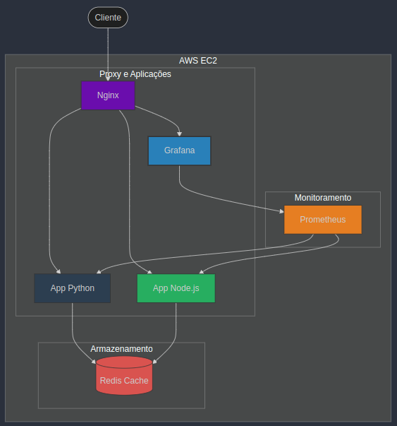
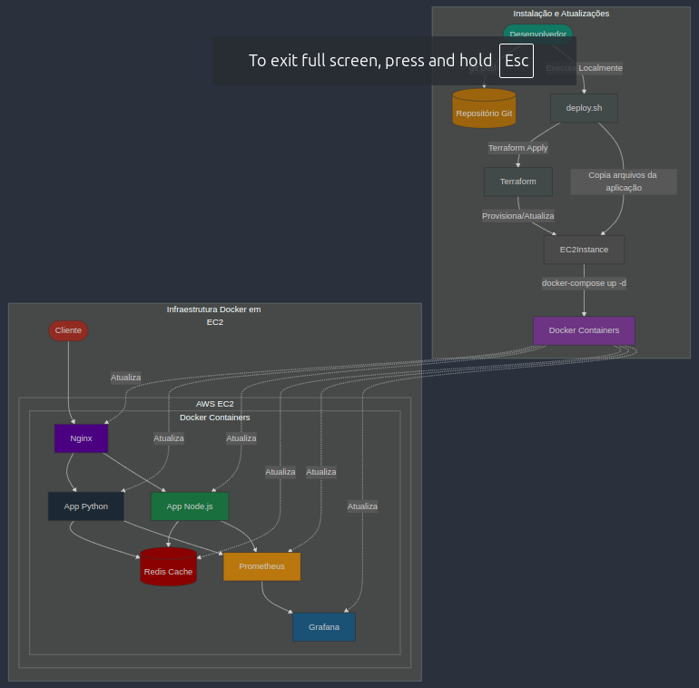

# 🚀 Projeto de infraestrutura na AWS (Terraform, Docker e Monitoramento)

Este projeto utiliza o **Terraform** com states locais, para provisionar uma infraestrutura na **AWS**, incluindo a criação de uma instância **EC2** com Ubuntu, a geração de um **key-pair**, a instalação do **Docker** e **Docker Compose**, e o deploy de duas aplicações com monitoramento utilizando **Prometheus** e **Grafana**. O script **deploy.sh** automatiza todo o processo de implantação e destruição da infraestrutura e aplicações.

## 📌 Requisitos

Para utilizar este projeto, certifique-se de atender aos seguintes requisitos:  

- **Terraform** `v1.10.5` ou superior.  
- **Provider AWS** `registry.terraform.io/hashicorp/aws v5.89.0` ou superior.  
- **AWS CLI** configurado com credenciais válidas.  
- **Conta AWS** com permissões suficientes para criar os recursos.  
- **Chave SSH pública** para acessar a instância EC2:  
  - **Tipo da Chave**: `ssh-rsa`.
  - **Formato válido**:`OpenSSH`.
  - **Chave Pública e Privada**: Deve estar no formato **Base64**, iniciando com `ssh-rsa` seguido da sequência de caracteres.   
  ⚠️ Caso você não tenha um par de chaves SSH, [execute os seguintes comandos](#-par-de-chaves-ssh)

## 📦 Estrutura do Projeto

O projeto está organizado da seguinte forma:

📦 **infrastructure/**: Contém os arquivos de configuração do Terraform para provisionar a infraestrutura na AWS.  
📦 **application/**: Contém os arquivos da aplicação que será implantada na instância EC2.  
⚙️ **deploy.sh**: Script para automatizar a implantação e destruição da infraestrutura e aplicação.  

## 📊 Diagramas

### Arquitetura  

Este diagrama ilustra a infraestrutura e os componentes do projeto:  



**Descrição:**

 - Cliente: Acessa as aplicações e o Grafana via Nginx.
 - Nginx: Atua como proxy reverso, direcionando as requisições para as aplicações Python, Node.js e Grafana.
 - Aplicações:
   - App Python: Aplicação Flask que interage com o Redis e envia métricas para o Prometheus.
   - App Node.js: Aplicação Node.js que também interage com o Redis e envia métricas para o Prometheus.
 - Redis: Cache compartilhado entre as aplicações.
 - Prometheus: Coleta métricas das aplicações.
 - Grafana: Visualiza as métricas coletadas pelo Prometheus.

### Diagramade Fluxo de Instalação/Atualização

Este diagrama mostra o processo de atualização e instalação do projeto:



**Descrição:**

- Desenvolvedor: Realiza alterações no código e executa o script deploy.sh.
- Repositório Git: Armazena o código-fonte do projeto.
- EC2 Instance: Instância AWS onde a infraestrutura é provisionada e as aplicações são executadas.
- Terraform: Provisiona e atualiza a infraestrutura na AWS.
- Docker Containers: Contêineres das aplicações e ferramentas de monitoramento.
- Fluxo de Atualização: O script deploy.sh atualiza o repositório local, executa o Terraform e sobe os contêineres com docker-compose.

## 📌 Como Usar

### Clone o Repositório
```bash
git clone https://github.com/owiltoncezar/aws-terraform-ec2-docker-apps.git
cd "pasta-onde-clonou"
```
### 🛠️ Configuração da Infraestrutura

1️⃣ Acesse a pasta /infrastructure e edite o arquivo terraform.tfvars conforme suas preferências:
```hcl
profile             = "nome-do-profile-configurado-para-o-awscli"
managed_by          = "Terraform"
region              = "regiao-que-deseja-criar-o-recurso"
name                = "nome-para-os-recursos(Instancia, Security Group, Key-par e etc.)"
instance_type       = "tipo-da-instância"
volume_type         = "tipo-do-disco-ebs"
volume_size         = "tamanho-do-disco-ebs"
public_key          = "valor da chave publica válida no formato do OpenSSH".
```

2️⃣ Acesse a pasta raiz e edite o arquivo deploy.sh e alterando o valor da variavél KEY_PATH:
```hcl
KEY_PATH="caminho da private_key"  
```

### ⚡ Executar o Script de Implantação

1️⃣ Torne o script deploy.sh executável:

```bash
chmod +x deploy.sh
```

2️⃣ Execute o script para implantar a infraestrutura e a aplicação:

```bash
./deploy.sh install
```
O script fará o seguinte:

- Provisionará a infraestrutura na AWS usando o Terraform.
- Instalará o Docker na instância EC2.
- Copiará a aplicação para a instância EC2.
- Instalará o docker.
- Executará a aplicação usando docker-compose.


### 🧹 Destruir a Infraestrutura  

Para remover a infraestrutura e todos os recursos criados, execute:
```bash
./deploy.sh destroy
```

### 🖥️ Acesso à Instância EC2

Após a implantação, você pode acessar a instância EC2 via SSH:

```bash
ssh -i "caminho-da-chave-privada" ubuntu@IP_PUBLICO_DA_EC2
```
### 🔍 Verificar a Aplicação

A aplicação estará rodando na instância EC2. Você pode verificar o status dos contêineres com:

```bash
docker ps
```
### 🌐 Acesso às Aplicações e Monitoramento

Após a implantação, você pode acessar as aplicações e o Grafana diretamente pelo navegador. Utilize os seguintes endereços:

**Aplicações**: 
   
Flask - Rota Fixed:
```bash
http://IP_PUBLICO_DA_EC2/flask/fixed
```
Flask - Rota Time:
```bash
http://IP_PUBLICO_DA_EC2/flask/time
```
Node - Rota Fixed:
```bash
http://IP_PUBLICO_DA_EC2/node/fixed
```
Node - Rota Time:
```bash
http://IP_PUBLICO_DA_EC2/node/time
```

**Grafana**:  
  
Acesso ao Grafana:
```bash
http://IP_PUBLICO_DA_EC2/grafana
```
 - Usuário padrão: admin
 - Senha padrão: admin (recomenda-se alterar após o primeiro login).


## ⚠️ Atenção

O script deploy.sh inclui: 

 - Comandos para instalar o Docker e configurar o ambiente na instância EC2. Ele também copia a pasta da aplicação para a instância e executa o docker-compose para subir a aplicação.
 - Pausas (sleep) para garantir que a instância EC2 esteja pronta para conexões SSH e para aplicar permissões de grupo após a instalação do Docker.  

Certifique-se de que a chave privada SSH esteja corretamente configurada no script deploy.sh.

## 🔑 Par de Chaves SSH

Caso você não tenha um par de chave ssh, execute o seguinte comando no terminal para gerar um par de chaves SSH:

```bash
ssh-keygen -t rsa -b 4096 -C "seu-email@exemplo.com" -f ~/.ssh/"nome_da_chave"
```
-t rsa: Define o tipo de chave como RSA.  
-b 4096: Define o tamanho da chave como 4096 bits (recomendado para maior segurança).  
-C "seu-email@exemplo.com": Adiciona um comentário à chave (geralmente um e-mail ou identificador).  
-f ~/.ssh/"nome_da_chave": Define o local e o nome do arquivo da chave (neste caso, asatech_key).

**Proteger a Chave Privada**.

Durante a criação, você será solicitado a definir uma senha (passphrase) para proteger a chave privada. Isso adiciona uma camada extra de segurança, porém não é obrigatória mas recomendado.

**Após a execução do comando, duas chaves serão geradas:**

 - Chave Pública: ~/.ssh/"nome_da_chave_key.pub"
 - Chave Privada: ~/.ssh/"nome_da_chave"

Você pode visualizar o conteúdo da chave pública com o comando:

```bash
cat ~/.ssh/"nome_da_chave_key.pub"
```
## 📌 Nota:

 - O valor que o comando ```cat ~/.ssh/"nome_da_chave_key.pub"``` retornar, deve ser informado na variável ```public_key``` do arquivo terraform.tfvars.  
 - O caminho da chave privada (```~/.ssh/"nome_da_chave"```), deve ser informado na variável do script deploy.sh ```KEY_PATH```. 
